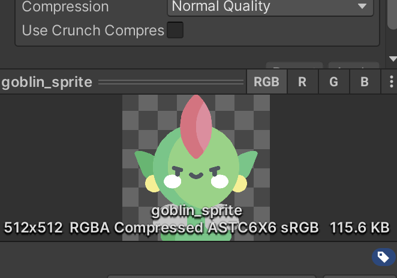
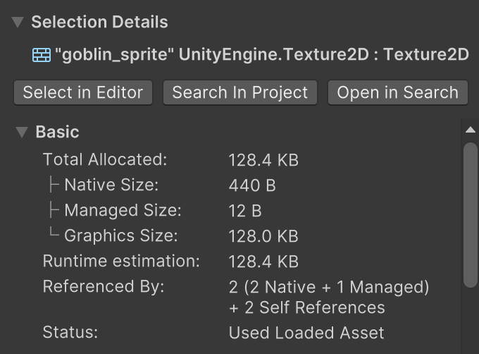
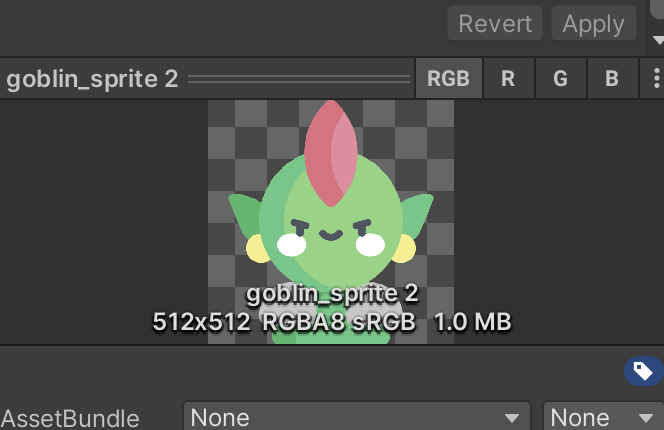
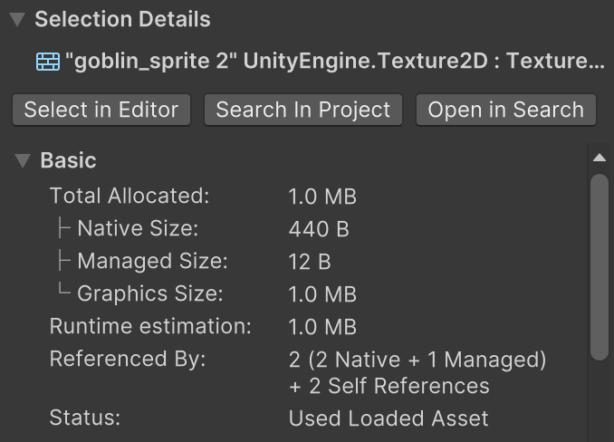

# 圖片記憶體分配差異

以下為同一張圖片在 **壓縮** 與 **未壓縮** 狀態下的記憶體分配差異。

---

## 壓縮過
  

---

## 沒壓縮過
  

---

**觀察重點**  
差異主要出現在 **Graphics Size**。  
其他類型（Native Size、Managed Size）屬於貼圖的 **Meta Data**，因此不會因壓縮與否而有明顯差異。

---

## 各類別意義說明
以下爲詢問AI簡述各類別代表意義
### Native Size
- 代表物件在 Unity **C++ Engine (Native Heap)** 端所佔用的記憶體。  
- 對 `Texture2D` 而言，這部分儲存的是 **結構描述資料**，例如：
  - 貼圖寬高
  - 格式
  - Mipmap 資訊
- 通常不大（幾百 Bytes ～ 幾 KB）。

---

### Managed Size
- 代表物件在 **C# Managed Heap** 端所佔用的大小。  
- 僅是 C# 端的 **Texture2D 包裝物件**（reference/指標），不包含像素資料。  
- 通常非常小（十幾 Bytes）。

---

### Graphics Size
- 代表 **GPU 記憶體 (VRAM)** 或 **Graphics Driver 分配區塊**內，存放實際 **像素資料**的大小。  
- `Texture2D` 的像素 Buffer 在這裡存放，通常是主要的記憶體消耗來源。  
- 例如：某張壓縮後的貼圖大小為 **128 KB**，就是它在 GPU 端的實際佔用量。

---

**AssetBundle 使用情況**  
下面的數據為，

---

