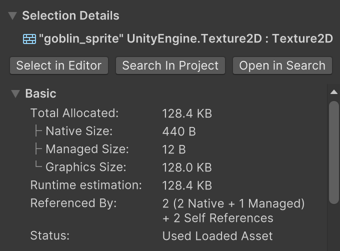

# 圖片記憶體分配差異

以下為同一張圖片在 **壓縮** 與 **未壓縮** 狀態下的記憶體分配差異。

---

## 壓縮過

---

## 沒壓縮過

---

**觀察重點**  
差異主要出現在 **Graphics Size**。  
其他類型（Native Size、Managed Size）屬於貼圖的 **Meta Data**，因此不會因壓縮與否而有明顯差異。

---

## 各類別意義說明
以下爲詢問AI簡述各類別代表意義
### Native Size
- 代表物件在 Unity **C++ Engine (Native Heap)** 端所佔用的記憶體。  
- 對 `Texture2D` 而言，這部分儲存的是 **結構描述資料**，例如：
  - 貼圖寬高
  - 格式
  - Mipmap 資訊
- 通常不大（幾百 Bytes ～ 幾 KB）。

---

### Managed Size
- 代表物件在 **C# Managed Heap** 端所佔用的大小。  
- 僅是 C# 端的 **Texture2D 包裝物件**（reference/指標），不包含像素資料。  
- 通常非常小（十幾 Bytes）。

---

### Graphics Size
- 代表 **GPU 記憶體 (VRAM)** 或 **Graphics Driver 分配區塊**內，存放實際 **像素資料**的大小。  
- `Texture2D` 的像素 Buffer 在這裡存放，通常是主要的記憶體消耗來源。  
- 例如：某張壓縮後的貼圖大小為 **128 KB**，就是它在 GPU 端的實際佔用量。

---

## AssetBundle 使用情況

本次測試設計了六種不同情境：

1. **空場景**：什麼都沒有載入  
2. **單一圖片包**：載入一個只包含一張圖片素材的 AssetBundle，並載入其中的貼圖  
3. **兩個單圖包**：載入兩個分別只包含一張圖片的 AssetBundle，並載入所有貼圖  
4. **十圖大包**：載入一個包含 10 張圖片素材的 AssetBundle，並載入所有貼圖  
5. **十圖大包 (單張載入)**：載入一個包含 10 張圖片素材的 AssetBundle，但僅載入其中一張貼圖  
6. **兩個單圖包 (單張載入)**：載入兩個分別只包含一張圖片素材的 AssetBundle，但僅載入其中一個 Bundle 的貼圖  

---

## 檢驗結果與觀察

載入 AssetBundle 後，記憶體配置會出現以下變化：

1. **Managed / Managed Objects / AssetBundle**  
   - 出現 **UnityEngine.AssetBundle** 的 C# wrapper  
   - 大小固定 **12 B**

2. **Native / UnitySystem / AssetBundle**  
   - 出現 **LoadingCache**  
   - 大小固定 **1 MB**

3. **Native / UnitySystem / SerializedFile**  
   - 出現 **archive:CAB...** 開頭的記憶體區塊  
   - 大小 **不固定**

4. **Native / Native Objects / AssetBundle**  
   - 出現已載入的 **AssetBundle 物件**  
   - 大小 **不固定**

5. **Native / Native Objects / (對應素材類型)**  
   - 若載入圖片，會出現 **Texture2D**  
   - 大小對應於 **Native Size**（ **440 B**）

6. **Managed / Managed Objects / (對應素材類型)**  
   - 若載入圖片，會出現 **Texture2D** 的 C# wrapper  
   - 大小對應於 **Managed Size**（ **12 B**）

7. **Graphics**  
   - 若載入圖片，會額外出現 **Texture2D** 的 GPU 記憶體佔用  
   - 大小對應於 **Graphics Size**

# 各情境下的記憶體變化

| 測試類別               | AssetBundle | SerializedFile         | Remapper          | Native Texture2D | Managed Texture2D | Graphics Texture2D |
|------------------------|-------------|------------------------|------------------|------------------|-------------------|--------------------|
| 空場景                 | 0 KB        | 0 KB                   | 128.1 KB          | 0 組              | 0 組              | 0 組               |
| 單一圖片包             | 4.5 KB      | 172.2 KB               | 128.1 KB          | 1 組           | 1 組              | 1 組             |
| 兩個單圖包             | 9.0 KB      | 172.3 + 172.2 KB       | 128.1 KB          | 2 組       | 2 組          | 2 組         |
| 十圖大包               | 5.2 KB      | 171.0 KB               | 128.1 KB          | 10 組       | 10 組         | 10 組        |
| 十圖大包 (單張載入)    | 5.2 KB      | 171.0 KB               | 128.1 KB          | 1 組            | 1 組              | 1 組             |
| 兩個單圖包 (單張載入)  | 9.0 KB      | 172.3 + 172.2 KB       | 128.1 KB          | 1 組            | 1 組              | 1 組             |

---

## 結論

根據表格觀察，可得出以下結論：

1. **AssetBundle 大小**  
   - 與圖片數量無強烈線性關係。  
   - 多圖合併在同一個 Bundle 中較為划算，圖片本身佔用AssetBundle記憶體的比例遠低於AssetBundle本身。

2. **SerializedFile 占用**  
   - 每個 AssetBundle 對應一個 SerializedFile。  
   - 即使只載入部分圖片，SerializedFile 的大小仍與整個 AssetBundle 綁定，不會隨實際載入數量縮小。

3. **Native / Managed Texture2D**  
   - 只會隨實際載入的圖片數量而變化。  
   - 單張圖片固定 **440 B (Native)** + **12 B (Managed)**。

4. **Graphics Texture2D (VRAM)**  
   - 僅依實際載入的貼圖數量增加。  
   - 每張圖固定佔用 **128 KB**。  
   - 即使 AssetBundle 內有多張圖片，未載入的圖片不會佔用 GPU 記憶體。

# Prefab 測試

## 📦 AssetBundle 使用情況

本次測試設計了八種不同情境：

1. **空場景**：什麼都沒有載入  
2. **空節點**：載入一個只包含一個 Prefab 的 AssetBundle，該 Prefab 只有一個 EmptyObject，並載入其中所有 Prefab  
3. **三階圓滿二元樹**：載入一個只包含一個 Prefab 的 AssetBundle，該 Prefab 呈現三階圓滿二元樹結構，每個節點都是空物件，並載入其中所有 Prefab  
4. **兩個三階圓滿二元樹**：載入兩個分別只包含一個 Prefab 的 AssetBundle，Prefab 為三階圓滿二元樹結構，並載入其中所有 Prefab  
5. **帶腳本三階圓滿二元樹**：載入一個只包含一個 Prefab 的 AssetBundle，Prefab 為三階圓滿二元樹結構，每個節點都是空物件並掛上一個基礎 MonoBehavior Class 腳本  
6. **五階圓滿四元樹**：載入一個只包含一個 Prefab 的 AssetBundle，Prefab 為五階圓滿四元樹結構，每個節點都是空物件  
7. **五階圓滿四元樹大包**：載入一個包含四個 Prefab 的 AssetBundle，每個 Prefab 為五階圓滿四元樹結構，並載入其中所有 Prefab  
8. **五階圓滿四元樹 (單載入)**：載入一個包含四個 Prefab 的 AssetBundle，每個 Prefab 為五階圓滿四元樹結構，但只載入其中一個 Prefab  

---

## 檢驗結果與觀察

載入 AssetBundle 後，記憶體配置的變化如下：

1. **Managed / Managed Objects / AssetBundle**  
   - 出現 `UnityEngine.AssetBundle` 的 C# wrapper  
   - 大小固定 **12 B**

2. **Native / UnitySystem / AssetBundle**  
   - 出現 **LoadingCache**  
   - 大小固定 **1 MB**

3. **Native / UnitySystem / Remapper**  
   - 出現 **Remapper 記憶體區塊**  
   - 大小 **不固定**

4. **Native / UnitySystem / SerializedFile**  
   - 出現 **archive:CAB...** 開頭的記憶體區塊  
   - 大小 **不固定**

5. **Native / Native Objects / AssetBundle**  
   - 出現已載入的 **AssetBundle 物件**  
   - 大小 **不固定**

6. **Native / Native Objects / (對應素材類型)**  
   - 載入 Prefab 後會出現 **GameObject、Transform、MonoBehavior**  
   - 大小固定  
     - GameObject **116 B**  
     - Transform **148 B**  
     - MonoBehavior **208 B**

7. **Managed / Managed Objects / (對應素材類型)**  
   - 載入 Prefab 後會出現 **GameObject、MonoBehavior** 的 C# wrapper  
   - 大小固定  
     - GameObject **12 B**  
     - MonoBehavior **16 B**

---

## 各情境下的記憶體變化

| 測試類別               | AssetBundle | SerializedFile         | Remapper          | GameObject | Monobehavior |
|------------------------|-------------|------------------------|-------------------|------------|--------------|
| 空場景                 | 0 KB        | 0 KB                   | 208.2 KB          | 0 組       | 0 組         |
| 空節點                 | 4.5 KB      | 13.6 KB                | 208.2 KB          | 1 組       | 0 組         |
| 三階圓滿二元樹          | 4.5 KB      | 15.5 KB                | 208.2 KB          | 1 組       | 0 組         |
| 兩個三階圓滿二元樹       | 4.6 + 4.5 KB| 15.5 + 15.5 KB         | 208.2 KB          | 2 組       | 0 組         |
| 帶腳本三階圓滿二元樹     | 4.6 KB      | 21.7 KB                | 208.2 KB          | 1 組       | 1 組         |
| 五階圓滿四元樹          | 7.2 KB      | 121.9 KB               | 240.2 KB          | 1 組       | 0 組         |
| 五階圓滿四元樹大包       | 15.4 KB     | 268.1 KB               | 464.2 KB          | 4 組       | 0 組         |
| 五階圓滿四元樹 (單載入)  | 15.4 KB     | 268.1 KB               | 464.2 KB          | 1 組       | 0 組         |

---

## 總結

根據表格可得出以下結論：

1. **AssetBundle 大小**  
   - 與 Prefab 的複雜度有關，但不會線性增長。  
   - 多個 Prefab 打包在同一個 AssetBundle 中，比分散在多個 AssetBundle 更節省空間。

2. **SerializedFile 大小**  
   - 隨 Prefab 的結構複雜度顯著增長（例如五階四元樹）。  
   - 與實際載入的 Prefab 數量無關，只要存在於 AssetBundle，SerializedFile 就會佔用。

3. **Remapper**  
   - 出現後大小相對穩定，但會隨載入規模擴大（例：五階四元樹比三階二元樹更大）。

4. **GameObject / MonoBehavior 記憶體消耗**  
   - 與 **載入 Prefab 的數量**直接相關。  
   - GameObject 與 MonoBehavior 在 Native 與 Managed 的大小固定，僅隨數量成倍增加。  
   - 加上腳本 (MonoBehavior) 的 Prefab 額外產生固定記憶體消耗。

5. **大包 vs 單載入**  
   - 即使同一個大包中只載入部分 Prefab，SerializedFile 與 Remapper 仍會全額計算。  
   - 但 Native/Managed Objects 僅隨實際載入的 Prefab 增長。

---

**結論**  
- Prefab 的結構複雜度與 SerializedFile/Remapper 有直接關聯。  
- Prefab 的實際載入數量決定 Native/Managed Objects 與 MonoBehavior 的數量。  
- 大包更省 AssetBundle 空間，但 SerializedFile 與 Remapper 的成本固定存在。  

---

# 圖片 vs Prefab 記憶體觀察：交叉比對與總結

## 一、圖片類（Texture）重點回顧

- **AssetBundle/SerializedFile**  
  - **以「Bundle 數」為主**：兩個單圖包（2 個 bundle）就出現 `172.3 + 172.2 KB` 的 SerializedFile，加總明顯；而 10 圖合併在單一 bundle 時 SerializedFile 仍約 **171 KB** 左右。  
  - **素材是否實際載入不影響 SerializedFile/AssetBundle 大小**：`十圖大包 (單張載入)` 與 `十圖大包 (全載)` 的 AssetBundle/SerializedFile 相同。

- **Remapper**  
  - 圖片組合中觀察到為 **128.1 KB**（基準固定）。

- **Native/Managed/Graphics**  
  - 僅**隨實際載入資產數量**而增加：  
    - `Native Texture2D` ≈ **440 B/張**  
    - `Managed Texture2D` ≈ **12 B/張**  
    - `Graphics Texture2D` ≈ **128 KB/張 (VRAM)**

> 圖片類的「**主要變動成本在 Graphics（VRAM）**」，而 Bundle/SerializedFile 多半是**每個 bundle 固定攤提**。

---

## 二、Prefab 類重點回顧

- **AssetBundle/SerializedFile**  
  - **與結構複雜度高度相關**：  
    - `三階圓滿二元樹` SerializedFile ≈ **15.5 KB**  
    - `五階圓滿四元樹` SerializedFile ≈ **121.9 KB**（大幅成長）  
    - 多個 Prefab 合包（大包）→ SerializedFile ≈ **268.1 KB**  
  - **單載入 vs 全載**：大包的 `單載入` 與 `全載` 在 AssetBundle/SerializedFile **相同**。

- **Remapper**  
  - **隨 Prefab 階層/引用關係成長**：  
    - 簡單結構 ≈ **208.2 KB**  
    - 複雜結構（五階四元樹）≈ **240.2 KB**  
    - 大包（四個五階四元樹）≈ **464.2 KB**

- **Native/Managed（物件層）**  
  - **依實際載入的 Prefab 數量與其所含組件種類成長**：  
    - 有無 `MonoBehaviour` 會帶來**固定但可觀**的額外開銷。  
    - 表中以「幾組」呈現聚合（Profiler 的群組統計），**實際物件數更大**（特別是多階樹狀結構）。

> Prefab 類的「**主要變動成本在 SerializedFile 與 Remapper（受結構複雜度影響）**」，其次才是實際載入之 GameObject/MonoBehaviour 帶來的 Native/Managed 成本。

---

## 三、交叉比對（圖片 vs Prefab）

| 面向 | 圖片類（Texture） | Prefab 類 |
|---|---|---|
| **AssetBundle/SerializedFile** | 主要與 **bundle 數**相關；10 張圖放同一包更省 SerializedFile（≈171 KB） | 與 **Prefab 結構複雜度**顯著相關；層級/分支越多，SerializedFile 成長越快 |
| **Remapper** | 固定觀察值 **≈128.1 KB** | 隨結構/數量**可明顯上升**（208.2 → 240.2 → 464.2 KB） |
| **Native/Managed（物件層）** | 按**貼圖數**線性成長（Texture2D：Native 440 B / Managed 12 B/張） | 按**實際載入的 Prefab 組合**成長；含 `MonoBehaviour` 會再增加固定成本 |
| **Graphics（VRAM）** | **主要成本來源**：每張圖 ≈ **128 KB** | **不適用**（Prefab 自身不佔 Graphics；除非含有材質/貼圖才會影響） |
| **單載入 vs 全載** | 單載入不改變 AB/SerializedFile/Remapper；只影響 Native/Managed/Graphics 的「張數」 | 單載入不改變 AB/SerializedFile/Remapper；只影響 Native/Managed（物件組數/腳本數） |

---

## 四、實務策略建議

1. **控制 bundle 數量與內容分佈**  
   - 圖片：**多圖合包**能顯著壓低 SerializedFile 總量；但要注意載入粒度（避免為了取 1 張圖而載入很大包）。  
   - Prefab：將**高度複雜或大量物件的 Prefab**適度拆分，降低單包的 SerializedFile/Remapper 峰值。

2. **按需載入（On-Demand）**  
   - 只會改變「Native/Managed/Graphics（或物件層）」的增量，**不會**改變已打開 bundle 的 AB/SerializedFile/Remapper 成本。  
   - 因此，**包的切割策略**比「單載入」更能決定基線成本。

3. **Prefab 結構優化**  
   - 減少**過深/過寬樹狀**結構中的空節點與冗餘組件。  
   - 僅在必要節點掛 `MonoBehaviour`，其餘以資料驅動或合併邏輯替代，降低固定開銷。

4. **圖片優化**  
   - 圖片的主要成本在 **Graphics（VRAM）**：  
     - 使用更高壓縮格式（ASTC/ETC2 等）與合理的 mipmap。  
     - 非必要時關閉 **Read/Write** 以避免 CPU 端雙份貼圖。

---

## 六、決策要點（Checklist）

- 若目的是**壓低峰值記憶體**：  
- 圖片：優先壓縮貼圖 & 控制同時載入張數。  
- Prefab：拆分大型/複雜 Prefab，避免 Remapper/SerializedFile 蓄積過高。

- 若目的是**減少啟包成本**：  
- 減少 bundle 數量（圖片合包），或讓包的內容更同質（Prefab 分散但避免過度細碎）。  
- 依據場景/關卡切割，讓一次僅需要少量包。

---